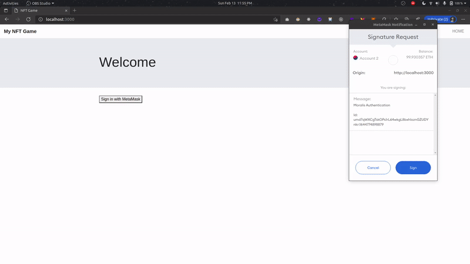

# **NFT-GAME**
## **PROJECT DEMO**

<!--  -->
## **HOW TO SETUP**
#### 1. Download this code, and from command prompt run:

        npm install

        truffle init

        npm install -g nodemon

        truffle compile

        truffle migrate --reset

#### 2. To run the code, run:
        
        npm run server

#### 3. In the browser open http://localhost:3000/, and you should see the index page